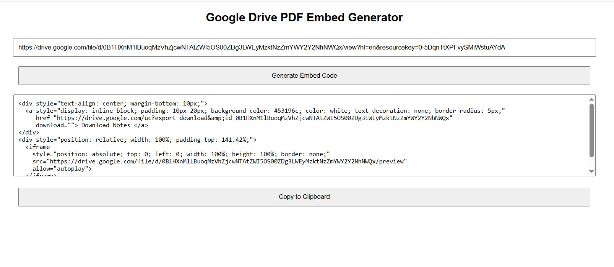

# 📄 Google Drive PDF Embed Code Generator

This is a lightweight web tool that generates embed code for displaying Google Drive-hosted PDFs on any website. It also includes a styled "Download Notes" button for convenience.

## 🚀 Features

- Accepts a Google Drive shareable file URL
- Extracts the file ID and generates embed + download code
- Displays the generated HTML in a text area
- One-click copy-to-clipboard functionality
- Responsive and mobile-friendly design

## 📸 Demo



## 🧠 How it works

When you enter a Google Drive file URL, the tool extracts the file ID using a regular expression and then builds an iframe embed code using this format:

```html
<iframe src="https://drive.google.com/file/d/FILE_ID/preview"></iframe>
